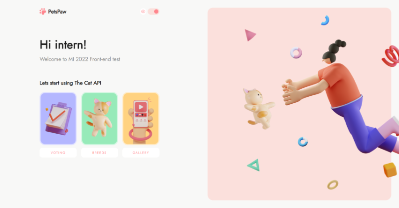
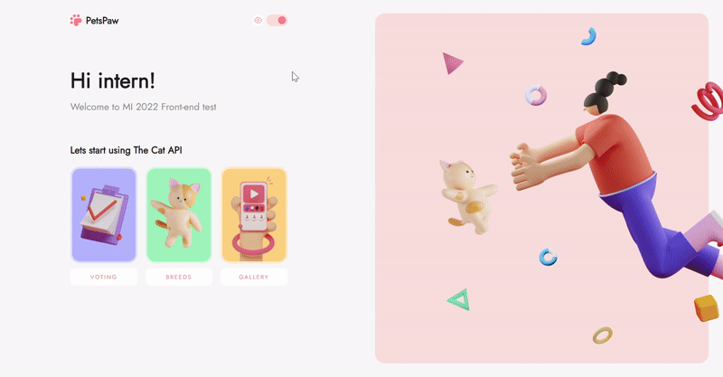
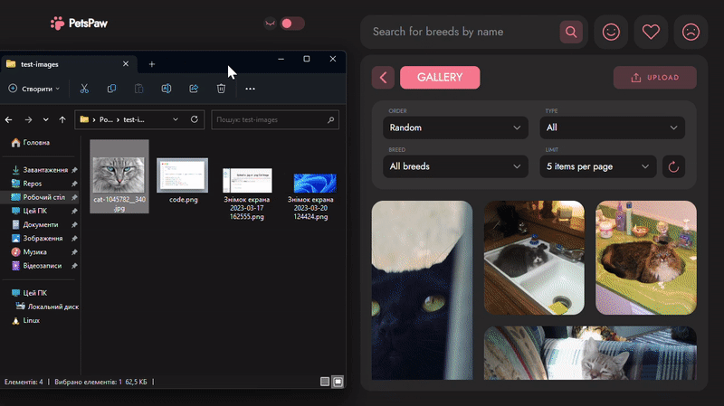
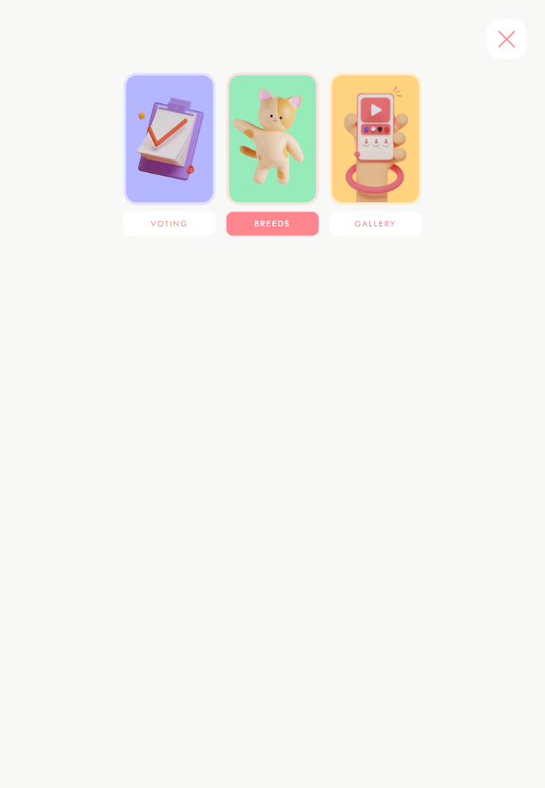
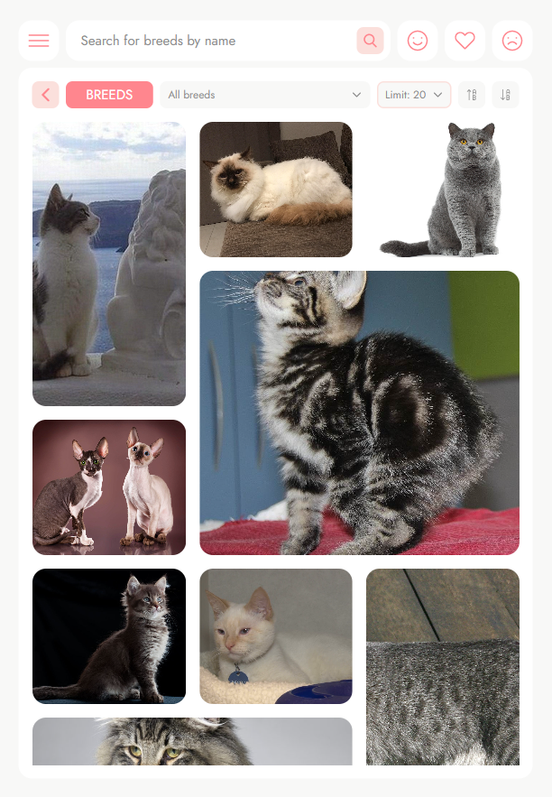

# Cats web app

[Link to the cats web app](https://denys-lytvynenko.github.io/cats-app/)

## Table of content

---

-   [Project description](#project-description)
    -   [List of used technologies](#technologies)
    -   [Figma prototype](#figma-prototype)
-   [Installation and running](#how-to-install-and-run-the-project)
    -   [Installation](#to-install-clone-project-and-run-next-command-in-cli)
    -   [Run dev](#to-run-app-locally-run-next-command)
    -   [Make production build](#to-build-a-production-build-run-next)
    -   [Preview production build on local machine](#to-preview-this-production-build-locally-run-next)
    -   [Run tests](#to-run-tests)
-   [Project overview](#project-overview)
    -   [Home page](#home-page)
    -   [Dark mode manual switching](#dark-mode-manual-switching)
    -   [Dark mode auto detection](#dark-mode-auto-detection)
    -   [Dark mode auto detection](#dark-mode-auto-detection)
    -   [Voting page](#voting-page)
    -   [Breeds page](#breeds-page)
    -   [Breed page](#breed-page)
    -   [Gallery page](#gallery-page)
    -   [Upload file modal](#upload-file-modal)
    -   [Likes page](#likes-page)
    -   [Favourites page](#favourites-page)
    -   [Dislikes page](#dislikes-page)
    -   [Dislikes page](#dislikes-page)
    -   [Search page](#search-page)
    -   [Tablet navigation menu](#tablet-navigation-menu)
    -   [Tablet layout](#tablet-layout)
    -   [Mobile layout](#mobile-layout)
-   [License text](#license)

## Project description

---

This application is my realization of [MacPaw](https://macpaw.com/) 2022 test task.

Application gives you ability to see information about cats breed, vote for yor favourite breed, upload your images of cat and more from any device.  
This web application uses [Cat API](https://www.thecatapi.com/) under the hood.

### Technologies:

-   [React.js](https://react.dev/) - Fast library for web and native user interfaces (Used for UI creation).
-   [Redux](https://redux.js.org/) - A Predictable State Container for JS Apps (Used for containing and managing of application state)
-   [Typescript](https://www.typescriptlang.org/) - A strongly typed programming language that builds on JavaScript, giving you better tooling at any scale. (Used for decreasing bugs and catching errors early in editor not on production)
-   [Sass](https://sass-lang.com/) - Sass is the most mature, stable, and powerful professional grade CSS extension language in the world (Used for application styling).
-   [Jest](https://jestjs.io/) - Jest is a delightful JavaScript Testing Framework with a focus on simplicity (Used for writing unit tests).

### Figma prototype:

-   [Design file](<https://www.figma.com/file/2bQpC9vw28txetIXWMEy5y/MI-2022---Frontend-(Copy)-(Copy)?type=design&node-id=14378-3726&t=H6cOZmlv0Zb8MKXJ-0>) - it is a copy of the original design file.

## How to Install and Run the Project

---

### To install clone project and run next command in CLI:

```
npm i
```

### To run app locally run next command:

```
npm run dev
```

### To build a production build run next:

```
npm run build
```

This command creates production build that contains in dist folder in root of the project.

### To preview this production build locally run next:

```
npm run preview
```

### To run tests:

```
npm run test
```

## Project overview

---

### Home page:



### Dark mode manual switching:



### Dark mode auto detection:


### Voting page:


### Breeds page:


### Breed page:


### Gallery page:


### Upload file modal:



### Likes page:


### Favourites page:


### Dislikes page:


### Search page:


### Tablet navigation menu:



### Tablet layout:



### Mobile layout:


## License

---

Copyright (c) 2023 Denys Lytvynenko. All rights reserved.

Licensed under the [MIT](./LICENSE.txt) license.
